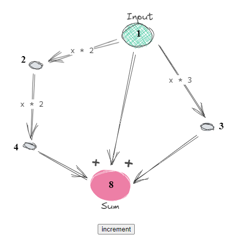

### State 

Is blazingly fast javascript library for managing reactive state.

##### features:

- monadic state (map, bind)
- topological sorting
- asynchronuous data (in progress)

#### Benchmark results
