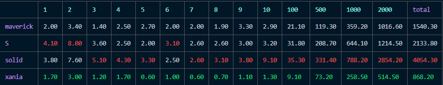



### State 

Is blazingly fast javascript library for managing reactive state.

#### Diamond problem

[live demo](https://stackblitz.com/edit/vitejs-vite-cxno2b?file=src%2FApp.tsx)

##### features:

- monadic state (map, bind)
- topological sorting
- asynchronuous data (in progress)
- scheduling (in progress)
- batching (in progress)

#### Benchmark results
