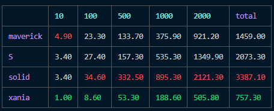

### State 

Is a javascript library for managing reactive state.

- monadic state (map, bind)
- topological sorting
- asynchronuous data

##### features:

-

#### Benchmark results

it's blazingly fast

